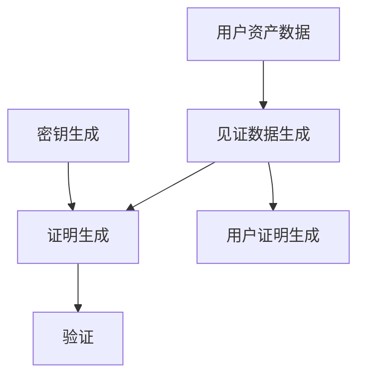

# ZKMerkle Proof of Solvency 项目解析
这是一个使用零知识证明(ZK Proof)技术来实现交易所偿付能力证明的项目。主要目的是让交易所能够证明其拥有足够的资产来覆盖所有用户的存款,同时保护用户隐私。
Groth16
# 核心概念
### 1. 偿付能力证明(Proof of Solvency)
这个系统允许交易所证明:
- 它持有的总资产大于或等于所有用户的净资产总和
- 每个用户的抵押品足以覆盖其债务
- 每个用户的权益大于或等于其抵押品总额
### 2. 防范虚拟用户攻击
系统引入了三个抵押品字段来防范"虚拟用户攻击":
- LOAN 抵押品
- COLLATERAL MARGIN 抵押品
- COLLATERAL PORTFOLIO MARGIN 抵押品

<br/>

每种资产都有对应的抵押率配置,用于计算实际可用的抵押价值。
### 3. 用户分组机制
系统根据用户持有的资产类型数量将用户分为不同组:
- 50种资产以下的用户一组
- 51-500种资产的用户一组
<br/>

所有用户数据都存储在一个Merkle树中。

# 系统架构
## 1. 数据存储层
- MySQL: 存储 witness、userproof、proof 表
- Redis: 提供分布式锁机制
- Kvrocks: 用于存储账户树

## 核心组件服务
### 2.1 密钥生成服务(Keygen)
- 生成电路相关的密钥对
- 支持多层级电路配置
- 生成文件
  - 证明密钥 (.pk)
  - 验证密钥 (.vk)
  - 约束系统 (.r1cs)
### 2.2 见证数据生成服务 (Witness)
- 处理用户资产负债表数据
- 生成电路输入的见证数据
- 支持故障恢复
- 每个见证批次包含:
  - 700个用户(≤50种资产)
  - 92个用户(51-500种资产)
### 2.3 证明生成服务 (Prover)
- 基于见证数据生成零知识证明
- 支持并行处理
- 性能:单批次约62秒
- 成本估算:
  - 50种资产以下用户: $0.0000127/个
  - 51-500种资产用户: $0.000097/个
### 2.4 用户证明服务 (UserProof)
- 生成用户Merkle证明
- 性能:约10,000用户/秒
- 支持内存树验证模式
### 2.5 验证服务 (Verifier)
- 批量证明验证
- 单用户证明验证
- 验证时间:约3毫秒/批次
## 3. 核心功能
### 3.1 偿付能力证明
- 验证总资产 ≥ 用户净资产总和
- 验证用户抵押品充足性
- 验证用户权益覆盖抵押品
### 3.2 抵押品管理
三类抵押品:
- LOAN 抵押品
- COLLATERAL MARGIN 抵押品
- COLLATERAL PORTFOLIO MARGIN 抵押品
每种资产配置:
- 抵押率梯度
- 总抵押额度限制
### 3.3 用户分组
- Group 1: ≤50种资产
  - 每批700用户
  - 约82,494个约束/用户
- Group 2: 51-500种资产
  - 每批92用户
  - 约622,241个约束/用户

# 安全特性
### 1. 防范虚拟用户攻击
- 引入抵押品分级机制
- 设置抵押率梯度
- 限制总抵押额度
### 2. 隐私保护
- 零知识证明保护用户数据
- Merkle树隐藏用户关系
### 3. 可验证性
- 完整的验证链路
- 支持单用户验证
- 支持批量验证

# 系统流程

## 1.1 初始化阶段
1. 密钥生成(Keygen)
- 生成两组密钥对：
  - 50种资产以下用户组：zkpor50_700.pk/vk
  - 51-500种资产用户组：zkpor500_92.pk/vk
2. 数据库准备
- MySQL：存储witness、userproof、proof表
- Redis：提供分布式锁
- Kvrocks：存储账户树
## 1.2 数据处理阶段
1. 见证数据生成(Witness)
- 读取用户资产负债表
- 按资产数量分组：
  - ≤50种资产：每批700用户
  - 51-500种资产：每批92用户
- 生成见证数据并存储
2. 用户证明生成(UserProof)
- 构建Merkle树
- 为每个用户生成Merkle证明
- 性能：约10,000用户/秒
## 1.3 证明生成阶段
1. 推送任务到Redis
- 将见证数据批次作为任务推送
2. 生成零知识证明(Prover)
- 从Redis获取任务
- 读取见证数据
- 生成零知识证明
- 存储证明数据
- 性能：单批次约62秒
## 1.4 验证阶段
1. 批量验证
- 验证所有批次的证明
- 验证时间：约3毫秒/批次
2. 单用户验证
- 验证单个用户的证明
- 检查用户资产和抵押品

## 核心验证流程
### 用户级别验证
1. 抵押品充足性验证
``` 用户总债务 ≤ 抵押品价值 * 抵押率```
2. 权益覆盖验证
``` 用户权益 ≥ 抵押品总额```

<br/>

### 系统级别验证
1. 总资产验证
``` 交易所总资产 ≥ 所有用户净资产总和 ```
2. 抵押品验证
``` 交易所声明抵押品 = 用户抵押品总和 ```


# 电路生成步骤
1. 密钥生成阶段 (Keygen)
    <p>生成电路相关的密钥对：</p>

- 证明密钥 (.pk)
- 验证密钥 (.vk)
- 约束系统 (.r1cs)
2. 见证数据生成阶段 (Witness)
  <p>生成电路输入的见证数据：</p>

- 处理用户资产负债表数据
- 生成电路所需的输入数据
3. 证明生成阶段 (Prover)
  <p>基于见证数据生成零知识证明：</p>
  
- 使用生成的密钥和见证数据
- 生成符合电路约束的证明